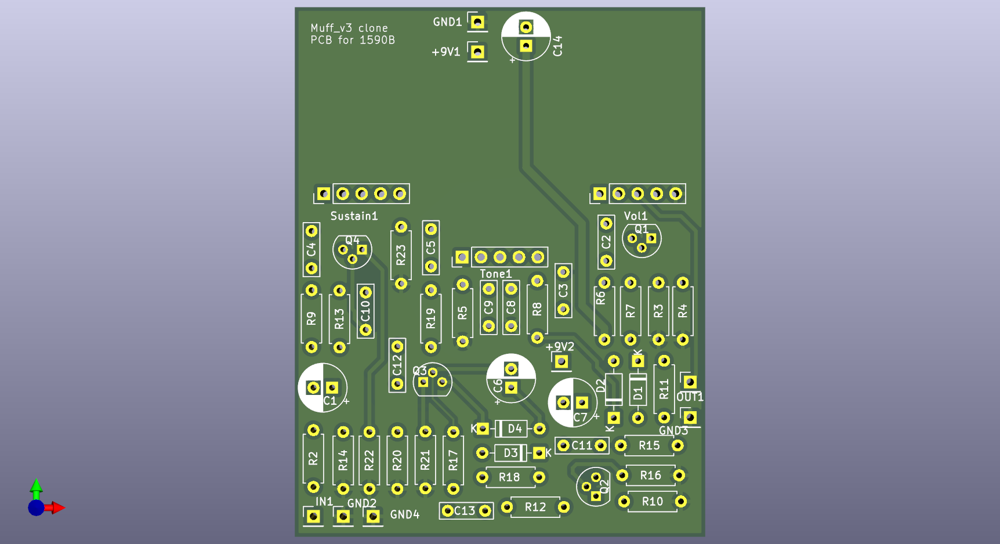
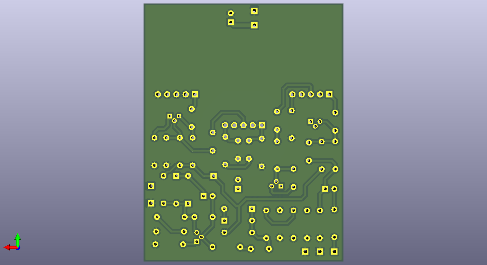

# BigMuff

This Is a clone of Electro-Hrmonix Big Muff guitar pedal.

### Circuit

The pedal is based on a circuit diagram by ElectroSmash. The schematic and parts list are available from the link below.
https://www.electrosmash.com/big-muff-pi-analysis

### PCB

The PCB was designed using KiCad software and can be seen below as a 3D render. It's designed to fit in a 1590B enclosure. Through hole components were selected for easier assembly at home.

The KiCad and Gerber files are available in this repository.

### Ready PCB

### Assembled PCB

### Ready Pedal

